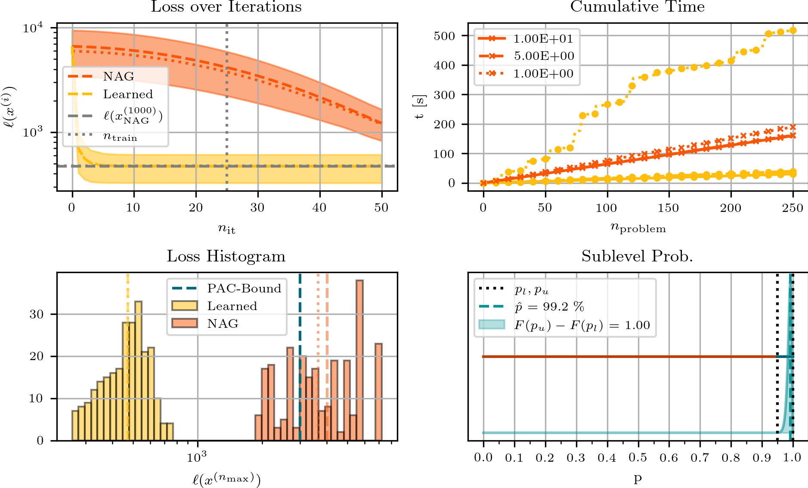

# Learning-to-Optimize with PAC-Bayesian Guarantees
### by Michael Sucker, Jalal Fadili and Peter Ochs
This repository contains the code to reproduce the experiments of our paper ["Learning-to-Optimize with PAC-Bayesian Guarantees:
Theoretical Considerations and Practical Implementation"](https://arxiv.org/pdf/2404.03290).

#### Note
Between the experiments, there is some dublicated code (set-up, plotting, etc.). This could be changed. It was done to have all needed code for one experiment in one folder.

### Experimental Results
1) Experiment on quadratic functions:

2) Experiment on quadratic functions:

3) Experiment for LASSO:

4) Neural-network-training experiment:

## TODO: 
  - Explain architecture
  - Explain how to reproduce experiments
  - Include a note to clarify why some code is duplicated in the experiments.
