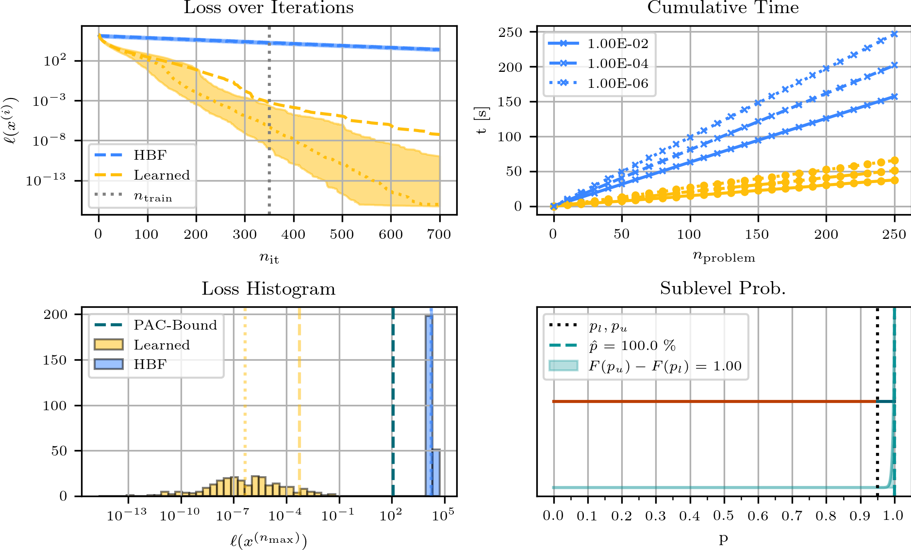

# Learning-to-Optimize with PAC-Bayesian Guarantees
### by Michael Sucker, Jalal Fadili and Peter Ochs
This repository contains the code to reproduce the experiments of our paper ["Learning-to-Optimize with PAC-Bayesian Guarantees:
Theoretical Considerations and Practical Implementation"](https://arxiv.org/pdf/2404.03290).

### Overview over the used classes
The code implements three main of classes:
  1) LossFunction
  2) OptimizationAlgorithm
  3) Constraint
Here, we have the following inheritance:

That is, `NonsmoothParametricLossFunction` inherits from `ParametricLossFunction`, which in turn inherits from `LossFunction`. Similarly, `PacBayesOptimizationAlgorithm` inherits from `ParametricOptimizationAlgorithm`, which in turn inherits from `OptimizationAlgorithm`. Finally, while being very related, `ProbabilisticConstraint` does not inherit from `Constraint`. However, the main method of `ProbabilisticConstraint` is used to create an `Constraint`-object, and the main task of `BayesianProbabilityEstimator` is to estimate the probability corresponding to the `ProbabilisticConstraint`.

#### Overview over the class LossFunction
The class `LossFunction` is used to represent loss-functions which the `OptimizationAlgorithm` should minimize. To instantiate such an object, one has to provide the corresponding implementation as parameter `function`. The main method (besides calling the function) is `compute_gradient` which allows for the automatic computation of gradients via back-propagation.

The class `ParametricLossFunction`inherits from `LossFunction`. The main difference is that `ParametricLossFunction` additionally expects the argument `parameter` in form of a dictionary. Note that the user is responsible for the correct interplay between `function` and `parameter`. Finally, the class `NonsmoothParametricLossFunction` is used to implement functions of the form $f + g$, where $f$ is smooth, and $g$ is non-smooth. However, whether $f$ and $g$ are actually smooth / non-smooth does not affect the implementation, as gradients / subgradients are computed by back-propagation anyways. To instantiate such an object, one has to specify the `whole_function`, the `smooth_part`, and the `nonsmooth_part`. Similarly, to compute the corresponding "gradients", the methods `compute_gradient_of_smooth_part` and `compute_gradient_of_nonsmooth_part` are provided.

**Remark**: Arguably, the name `NonsmoothParametricLossFunction` is not optimal. Maybe, `CompositeLossFunction` would be more appropriate.

#### Overview over the class OptimizationAlgorithm
The class 'OptimizationAlgorithm' implements a general, abstract optimization algorithm. To instantiate such an object, one has to specify the `implementation`, the `initial_state`, and the `loss_function`. Here, the `implementation` is an `nn.Module` ("a neural network"), which has to have the method `forward` and the method `update_state`. Taken together, they compute the next iterate (`forward`) and then update the `current_state` of the `OptimizationAlgorithm` accordingly. Examples are given in the folder `algorithms` or in the `experiments`. Further, one has to provide the `initial_state`, which basically is the starting point of the algorithm (maybe in a higher-dimensional space, see for example `HeavyBallWithFriction`). Laslty, one has to provide a 'LossFunction'-object for the parameter 'loss_function'. 

The main methods are `perform_step` to perform one iteration of the algorithm on the given 'loss_function', 'set_loss_function' to apply the algorithm to another loss-function than before, and `set_current_state` to change the `current_state`of the algorithm. However, there are many more methods implemented.

**Remark**: If the `OptimizationAlgorithm` should satisfy a certain `Constraint`, this can also directly be provided as parameter `constraint`(default = `None`), or via the method `set_constraint`.

The class `ParametricOptimizationAlgorithm` inherits from `OptimizationAlgorithm` and provides methods to learn the hyperparameters of the algorithm. Here, the hyperparameters of the algorithm are the parameters of the `nn.Module`-object that is provided as `implementation`. To learn the algorithm, one can use the method `fit`, which implements the procedure specified in our paper. To improve stability of the learning-process, one can first call the method `initialize_with_other_algorithm`, where the algorithm gets trained to "follow" another algorithm. Finally, there is the method `sample_with_sgld` which implements "Stochastic Gradient Langevin Dynamics", which is needed in the construction of the prior. If one has stored the hyperparameters as `state_dict()` (from PyTorch), then one can also load these into an `ParametricOptimizationAlgorithm` with the method `set_hyperparameters_to`.

Finally, the class `PacBayesOptimizationAlgorithm` inherits from `ParametricOptimizationAlgorithm`. To instantiate such an object, one additionally has to provide the `pac_parameters`, which, for example, encompass the sufficient-statistics and the natural parameters of the corresponding exponential family. The main additional method is `pac_bayes_fit`, which implements the learning procedure outlined in the paper. After this, the `PacBayesOptimizationAlgorithm` is instantiated with the hyperparameters that are found by the training procedure (and maximum likelihood at the end), and it has computed a `pac_bound`, which corresponds to the provided theoretical guarantee.

**Remark**: For more implementation details, please have a look at the paper.

#### Overview over the class Constraint
The class `Constraint` implements constraints to which the `OptimizationAlgorithm` should obey. To instantiate such an object, one has to provide a `function`, which implements the `Constraint` and evaluates to `True` or `False`. Typically, `function` takes the `OptimizationAlgorithm` itself as input, because all the needed elements are stored in `OptimizationAlgorithm`. 

The class `ProbabilisticConstraint` is used to create a `Constraint` based on the probabilistic constraining procedure outlined in the paper. To instantiate such an object, one has to provide a `list_of_constraints`, which can be used for estimation, and the `parameters_of_estimation`, which specify the accuracy of the resulting estimate. The main method of `ProbabilisticConstraint` is `create_constraint`, which turns the described procedure into a `Constraint`-object. To do this, it uses an `BayesianProbabilityEstimator`, which implements the estimation procedure outlined in the paper, that is, a Bayesian estimation of the success-probability of Bernoulli random variables with a Beta prior. Correspondingly, its main method is 'estimate_probability'.

### Experimental Results
The experiments are implemented in the folder `experiments`. Each of these experiments implements an `algorithm.py`, the `data_generation.py`, the actual `training.py`, the `evaluation.py`, and the `plotting.py`. Here, the way we generate the data (with all its parameters) is specified in `data_generation.py`. Similarly, the training procedure with all its parameters is specified in `training.py`. If you just want to `run` a specific experiments, you can have a look at the corresponding file `run_experiments.py`. Here, you have to specfiy the `path_of_experiment`, that is, where all the data will be stored in (parameters, intermediate results, final results). The only exception to this is 'image_processing' experiment, in which you also have to specify the folder to the images that you want to use.

#### Remark
Between the experiments, there is some dublicated code (set-up, plotting, etc.). This is not optimal and could be changed. However, it was done on purpose to have all needed code for one experiment in one folder.

If everything works out correctly, you should get plots that look like the following:

#### 1) Quadratic functions:

#### 2) Image processing:

#### 3) LASSO:

#### 4) Training a neural network:

### Final comments
The procedure is implemented in such a way, such that it is widely applicable and one can exchange the architecture of the algorithm easily. Basically, the only thing that has to be changed is the `implementation` of the corresponding `nn.Module`. This makes it very useful in the experimental stage, as one can run many different experiments in a short amount of time. However, based on its generality, it has some computational bottlenecks. All of them are related to computing the `pac_bound` in the `PacBayesOptimizationAlgorithm`. The main problem appears in the method `evaluate_sufficient_statistics_on_all_parameters_and_hyperparameters`, which computes the values of the sufficient statistic for all combinations of parameters and hyperparameters. In principle, there is no way around this, because we have to have the corresponding values to compute the theoretical guarantee. However, for a given concrete application, it might be possible to parallelize these operations. Another computationally expensive part is the sampling procedure with SGLD to construct the prior distribution. This is due to the fact that it has to happen iteratively and some samples need to be rejected in our case. If one is lucky, in the sense of having a concrete application where one can just use a specific predefined distribution without constraints, this can also be replaced.

Thanks for your interest in our work. I hope this short overview was helpful to you!
